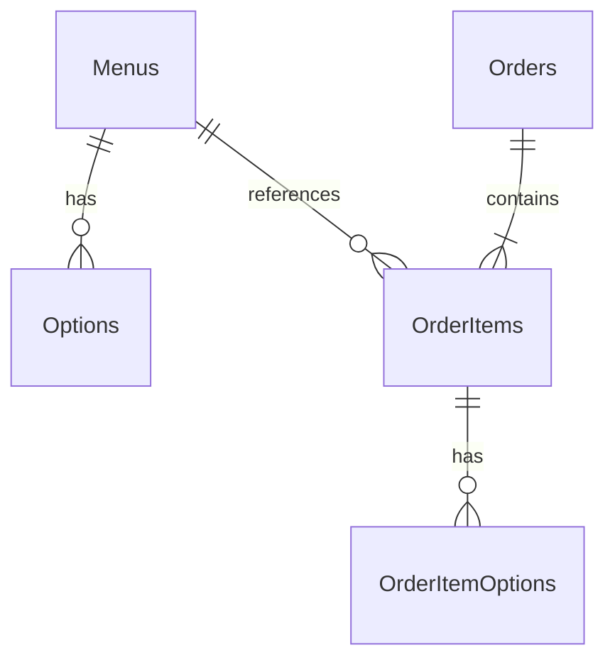

# COZY 커피 주문 앱 — 제품 요구사항 문서 (PRD)

| 항목 | 내용 |
|------|------|
| **서비스명** | COZY |
| **문서 버전** | 0.3 |
| **대상** | 프런트엔드(ui/), 백엔드(server/) |

**화면별 상세 PRD**

- [주문하기 화면](./PRD-order.md)
- [관리자 화면](./PRD-admin.md)

---

## Part 1. 프런트엔드 UI (요약)

현재 `ui/`에 구현된 화면 기준 요약이다. **주문하기 상세**는 [`PRD-order.md`](./PRD-order.md)를 참고한다.

### 화면

| 화면 | 설명 |
|------|------|
| **주문하기** | 메뉴 카드, 옵션, 장바구니, 주문 제출 |
| **관리자** | 대시보드(4지표), 재고 현황(3메뉴), 주문 현황 |

### 주문 상태 (프런트엔드 현재)

| 코드 | 표시명 | 비고 |
|------|--------|------|
| `RECEIVED` | 주문 접수 | 고객 주문 직후 |
| `IN_PREPARATION` | 제조 중 | 관리자 **제조 시작** 클릭 |
| `COMPLETED` | 제조 완료 | (UI 미구현, 백엔드 PRD에서 확장) |

### 재고 정책 (프런트엔드 현재)

- 재고 추적: 아메리카노(ICE), 아메리카노(HOT), 카페라떼
- 0개: 품절 / 5개 미만: 주의 / 그 외: 정상
- 주문 시 재고 차감, 품절 시 담기 비활성

---

## Part 2. 백엔드 PRD

백엔드는 **Menus**, **Options**, **Orders**를 영속 저장하고, 프런트엔드 주문·관리자 흐름을 API로 제공한다.

---

### 2.1 데이터 모델

#### 2.1.1 Menus (메뉴)

커피 메뉴 마스터. 주문 화면 목록·관리자 재고의 기준 엔티티.

| 필드 | 타입 | 필수 | 설명 |
|------|------|------|------|
| `id` | string (PK) | O | 메뉴 식별자 (예: `americano-ice`) |
| `name` | string | O | 커피 이름 (예: 아메리카노(ICE)) |
| `description` | string | O | 설명 |
| `price` | integer | O | 기본 가격(원, 정수) |
| `image_url` | string | X | 이미지 URL (없으면 placeholder) |
| `stock_quantity` | integer | O | 재고 수량 (0 이상) |
| `created_at` | datetime | O | 생성 일시 |
| `updated_at` | datetime | O | 수정 일시 |

**비고**

- `stock_quantity`는 주문 화면에는 노출하지 않고, **관리자 재고 현황** 및 품절 판단에 사용한다.
- 재고 상태 라벨(정상/주의/품절)은 API에서 계산해 내려주거나, 프런트에서 `stock_quantity` 기준으로 산출한다.
  - `0` → 품절
  - `1~4` → 주의
  - `5 이상` → 정상

---

#### 2.1.2 Options (옵션)

메뉴에 연결되는 추가 옵션(샷, 시럽 등).

| 필드 | 타입 | 필수 | 설명 |
|------|------|------|------|
| `id` | string (PK) | O | 옵션 식별자 (예: `extra-shot`) |
| `name` | string | O | 옵션 이름 (예: 샷 추가) |
| `price` | integer | O | 옵션 추가 가격(원, 0 가능) |
| `menu_id` | string (FK) | O | 연결할 메뉴 (`Menus.id`) |
| `created_at` | datetime | O | 생성 일시 |
| `updated_at` | datetime | O | 수정 일시 |

**관계**

- Menus 1 : N Options
- 동일 옵션명이 메뉴마다 별도 row로 존재할 수 있다 (`menu_id` 기준).

---

#### 2.1.3 Orders (주문)

고객이 제출한 주문. 헤더 + 주문 라인(스냅샷) 구조를 권장한다.

**Order (주문 헤더)**

| 필드 | 타입 | 필수 | 설명 |
|------|------|------|------|
| `id` | string (PK) | O | 주문 ID (UUID 등) |
| `ordered_at` | datetime | O | 주문 일시 |
| `status` | enum | O | `RECEIVED` \| `IN_PREPARATION` \| `COMPLETED` |
| `total_amount` | integer | O | 주문 총액(원) |
| `created_at` | datetime | O | 레코드 생성 일시 |
| `updated_at` | datetime | O | 상태 변경 일시 |

**OrderItem (주문 라인)** — 주문 내용(메뉴, 수량, 옵션, 금액)

| 필드 | 타입 | 필수 | 설명 |
|------|------|------|------|
| `id` | string (PK) | O | 라인 ID |
| `order_id` | string (FK) | O | 주문 ID |
| `menu_id` | string (FK) | O | 메뉴 ID |
| `menu_name` | string | O | 주문 시점 메뉴명 (스냅샷) |
| `quantity` | integer | O | 수량 |
| `unit_price` | integer | O | 1개당 단가(기본가+옵션가) |
| `line_total` | integer | O | 라인 금액 (`unit_price * quantity`) |

**OrderItemOption (주문 라인 옵션)**

| 필드 | 타입 | 필수 | 설명 |
|------|------|------|------|
| `id` | string (PK) | O | |
| `order_item_id` | string (FK) | O | |
| `option_id` | string | O | 옵션 ID (스냅샷) |
| `option_name` | string | O | 옵션 이름 (스냅샷) |
| `option_price` | integer | O | 옵션 가격 (스냅샷) |

**주문 상태**

| status | 표시명 (관리자) | 설명 |
|--------|-----------------|------|
| `RECEIVED` | 주문 접수 | 주문 저장 직후 기본값 |
| `IN_PREPARATION` | 제조 중 | 관리자 상태 전환 |
| `COMPLETED` | 완료 | 제조 완료 |

**상태 전이**

```
RECEIVED → IN_PREPARATION → COMPLETED
```

- 관리자가 **주문 접수** 처리 시 → `IN_PREPARATION` (제조 중)
- 관리자가 **완료** 처리 시 → `COMPLETED`

---

#### 2.1.4 ER 개요



---

### 2.2 데이터 스키마를 위한 사용자 흐름

#### ① Menus 조회 → 화면 표시

1. 클라이언트가 **Menus**(및 연결된 **Options**) 목록 API를 호출한다.
2. 응답의 메뉴·옵션·가격·이미지를 **주문하기** 화면에 표시한다.
3. `Menus.stock_quantity`는 고객 주문 화면에 직접 노출하지 않는다.
4. 관리자 **재고 현황**에서는 `Menus.stock_quantity`와 상태(정상/주의/품절)를 표시한다.

#### ② 메뉴 선택 → 장바구니 (클라이언트)

1. 사용자가 메뉴·옵션을 선택하고 **담기**를 누른다.
2. 선택 정보는 **브라우저 장바구니(클라이언트 상태)** 에 유지한다.
3. 동일 메뉴·동일 옵션 조합은 수량을 합산한다.

#### ③ 주문하기 → Orders 저장 · 재고 수정

1. 장바구니에서 **주문하기**를 클릭한다.
2. 서버가 주문 라인·재고를 검증한다.
3. 트랜잭션으로 처리한다.
   - **Orders** (+ OrderItems, OrderItemOptions) 저장
     - `ordered_at`: 서버 시각
     - `status`: `RECEIVED` (주문 접수)
     - 주문 내용: 메뉴, 수량, 옵션, 금액
   - **Menus.stock_quantity** 를 주문 수량만큼 감소
4. 재고 부족 시 저장하지 않고 오류를 반환한다.

#### ④ 관리자 — 주문 현황 · 상태 변경

1. **Orders** 목록을 **주문 현황**에 표시한다 (주문 일시, 메뉴·수량·옵션, 금액, 상태).
2. 기본 상태: **주문 접수** (`RECEIVED`).
3. 관리자 액션으로 상태를 변경한다.
   - `RECEIVED` → `IN_PREPARATION` (제조 중)
   - `IN_PREPARATION` → `COMPLETED` (완료)
4. **관리자 대시보드**: 총 주문 / 주문 접수 / 제조 중 / 완료 건수 집계.

#### ⑤ 관리자 — 재고 수동 조정

1. 재고 **+ / −** 로 `Menus.stock_quantity`를 갱신한다 (0 미만 불가).

---

### 2.3 API 설계

**Base URL (예시)**: `/api/v1`  
**Content-Type**: `application/json`  
**시간**: ISO 8601

---

#### 2.3.1 메뉴 목록 조회

「주문하기」메뉴 진입 시 DB에서 커피 메뉴 목록을 불러온다.

```
GET /api/v1/menus
```

**Response 200**

```json
{
  "menus": [
    {
      "id": "americano-ice",
      "name": "아메리카노(ICE)",
      "description": "시원하고 깔끔한 아이스 아메리카노",
      "price": 4000,
      "image_url": "/images/americano-ice.png",
      "options": [
        { "id": "extra-shot", "name": "샷 추가", "price": 500 },
        { "id": "extra-syrup", "name": "시럽 추가", "price": 0 }
      ],
      "available": true
    }
  ]
}
```

| 필드 | 설명 |
|------|------|
| `available` | `stock_quantity > 0`. 상세 재고 수는 고객 API에 미포함 |

---

#### 2.3.2 주문 생성

주문하기 버튼 클릭 시 주문 정보를 DB에 저장하고 메뉴 재고를 수정한다.

```
POST /api/v1/orders
```

**Request body**

```json
{
  "items": [
    {
      "menu_id": "americano-ice",
      "quantity": 1,
      "option_ids": ["extra-shot"]
    },
    {
      "menu_id": "americano-hot",
      "quantity": 2,
      "option_ids": []
    }
  ]
}
```

**처리 규칙**

1. `menu_id`·`option_ids` 유효성 검증
2. 서버에서 `unit_price`, `line_total`, `total_amount` 계산
3. 메뉴별 주문 수량 ≤ `stock_quantity` 확인
4. 트랜잭션: Orders 저장 + 재고 차감
5. 초기 `status`: `RECEIVED`

**Response 201**

```json
{
  "order": {
    "id": "ord_abc123",
    "ordered_at": "2026-05-22T13:00:00+09:00",
    "status": "RECEIVED",
    "status_label": "주문 접수",
    "total_amount": 12500,
    "items": [
      {
        "menu_id": "americano-ice",
        "menu_name": "아메리카노(ICE)",
        "quantity": 1,
        "unit_price": 4500,
        "line_total": 4500,
        "options": [
          { "option_id": "extra-shot", "option_name": "샷 추가", "option_price": 500 }
        ]
      }
    ]
  }
}
```

**Error**

| HTTP | code | 설명 |
|------|------|------|
| 400 | `INVALID_REQUEST` | 요청 형식 오류 |
| 409 | `INSUFFICIENT_STOCK` | 재고 부족 |
| 404 | `MENU_NOT_FOUND` | 없는 메뉴/옵션 |

---

#### 2.3.3 주문 단건 조회

주문 ID를 전달하면 해당 주문 정보를 반환한다.

```
GET /api/v1/orders/:orderId
```

**Response 200** — `POST /orders` 응답의 `order` 객체와 동일 구조

**Response 404** — `ORDER_NOT_FOUND`

---

#### 2.3.4 관리자 — 주문 목록 (프런트 연동)

```
GET /api/v1/admin/orders?status=active
```

- `status=active`: `COMPLETED` 제외
- 정렬: `ordered_at` 내림차순

**Response 200**

```json
{
  "orders": [],
  "dashboard": {
    "total": 10,
    "received": 3,
    "in_preparation": 2,
    "completed": 5
  }
}
```

---

#### 2.3.5 관리자 — 주문 상태 변경

```
PATCH /api/v1/admin/orders/:orderId/status
```

**Request body**

```json
{ "status": "IN_PREPARATION" }
```

| 현재 status | 허용 다음 status |
|-------------|------------------|
| `RECEIVED` | `IN_PREPARATION` |
| `IN_PREPARATION` | `COMPLETED` |

---

#### 2.3.6 관리자 — 재고 조회·수정

```
GET /api/v1/admin/inventory
```

```
PATCH /api/v1/admin/inventory/:menuId
```

```json
{ "delta": 1 }
```

---

### 2.4 API ↔ 프런트엔드 매핑

| 프런트 동작 | API |
|-------------|-----|
| 메뉴 표시 | `GET /menus` |
| 장바구니 담기 | (클라이언트) |
| 주문하기 | `POST /orders` |
| 관리자 주문 현황 | `GET /admin/orders` |
| 제조 시작 / 완료 | `PATCH /admin/orders/:id/status` |
| 재고 ± | `GET/PATCH /admin/inventory` |
| 주문 상세 | `GET /orders/:orderId` |

---

### 2.5 비기능 요구사항 (백엔드)

| 항목 | 권장 |
|------|------|
| **DB** | SQLite(개발) / PostgreSQL(운영) |
| **트랜잭션** | 주문 + 재고 차감 단일 트랜잭션 |
| **동시성** | 재고 row lock 또는 optimistic lock |
| **인증** | v1 미포함 |
| **CORS** | `ui` 개발 서버 origin 허용 |

---

### 2.6 시드 데이터 예시

| menu_id | name | price | stock |
|---------|------|-------|-------|
| americano-ice | 아메리카노(ICE) | 4000 | 10 |
| americano-hot | 아메리카노(HOT) | 4000 | 10 |
| cafe-latte | 카페라떼 | 5000 | 10 |

메뉴별 Options: `extra-shot` (+500), `extra-syrup` (+0).

---

### 2.7 오픈 이슈

1. 재고 추적 메뉴 범위 (3종 vs 전체)
2. 관리자 버튼 라벨과 API 상태명 통일
3. `COMPLETED` 주문 목록 노출 여부
4. 이미지: URL only vs 업로드 API

---

## 변경 이력

| 버전 | 내용 |
|------|------|
| 0.1 | 프런트엔드 주문·관리자 화면 PRD (초안) |
| 0.2 | 백엔드 데이터 모델·흐름·API 설계 추가 |
